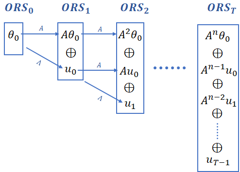

# Computing Reachable Sets of Uncertain Linear System
Given an uncertain linear system $x[t+1] = (A+ \Lambda) x[t]$, where $A \in \mathbb{R}^{n \times n}$ and $\Lambda \subset \mathbb{R}^{n \times n}$, this `Python` based prototype tool computes reachable sets of such system with various other functionalities.

The basic idea is given in the following figure:



Where:

* $\theta_0$ is the initial set.
* $ORS_t$ denotes the overapproximate reachable set at time step $t$.
* $S_1 \oplus S_2$ denotes minkowski sum of sets $S_1$ and $S_2$. 
* $u_t \subseteq \Lambda \cdot ORS_t$ (computed using our technique from the paper)

Please email [Bineet Ghosh](https://www.cs.unc.edu/~bineet/) at bineet@cs.unc.edu to get a preprint of the paper.

## Installation 

### Dependencies

* [`Python 3.9.x`](https://www.python.org/)
* [`NumPy`](https://numpy.org/)
* [`SciPy`](https://scipy.org/)
* [`mpmath`](https://mpmath.org/)
* [Gurobi](https://www.gurobi.com/) Python Interface:
  * Please obtain appropriate Gurobi License from [here](http://www.gurobi.com/downloads/licenses/license-center). Please note that if you are using Academic License, you **should be in your University network** (VPN should work fine too) while installing the license. Please refer to this [link](https://www.gurobi.com/documentation/8.1/quickstart_windows/academic_validation.html) for details. After the license is installed properly, Gurobi can be used from home network.
  * Install Gurobi. Please note that we will need Gurobi Python Interface. On-line documentation on installation can be found [here](http://www.gurobi.com/documentation/).
  * Gurobi Python Interface can also be installed through [Anaconda](https://www.anaconda.com/). Details on installing Gurobi Python Interface through `conda` can be found [here](https://www.gurobi.com/documentation/8.1/quickstart_mac/installing_the_anaconda_py.html#section:Anaconda).
* [Optional: Only needed to run the Mars Rover case study] [Dependencies for `Python Robotics`](https://github.com/AtsushiSakai/PythonRobotics#requirements) need to be installed. Note that one doesn't need to downloaded the `Python Robotics` repository — that's provided native with our code. Just installing the dependencies for `Python Robotics` is required. If one does not wish to run the Mars Rover case study, they can ignore this step.

### Downloading the tool

Once the dependencies are installed:

1. Download the repository to your desired location `/my/location/`:

   ```sh
   git clone https://github.com/bineet-coderep/Uncertain-Linear-System.git
   ```

2. Once the repository is downloaded, please open `~/.bashrc`, and add the line `export ULS_ROOT_DIR=/my/location/Uncertain-Linear-System/`, mentioned in the following steps:

   1. ```shell
      vi ~/.baschrc
      ```

   2. Once `.bashrc` is opened, please add the location, where the tool was downloaded, to a path variable `ULS_ROOT_DIR` (This step is crucial to run the tool):

      1. ```shell
         export ULS_ROOT_DIR=/my/location/Uncertain-Linear-System/
         ```

## Running the tool

Once the dependencies are installed properly, and the path variable is set, following steps should run without any error.

Following are some of the crucial functionalities offered by this prototype tool:

1. Reachable set computation of linear uncertain systems.
2. Ordering cells in a given dynamics matrix w.r.t to its effect on the reachable set.
3. Robustness Metric: Amount uncertainties that can introduced to the dynamics, without violating the safety.

### Case studies

We offer to case studies:

1. [Anesthesia](https://cps-vo.org/node/12111).
2. [Mars Rover](https://arxiv.org/abs/2108.01235).

Here, we illustrate the Anesthesia case study, as the other one can be run in similar fashion.

1. ```shell
   cd src/
   ```

2. ```shell
   python Anasthesia.py
   ```

One should see the following plot in `/my/location/Uncertain-Linear-System/output/pkpd_results`:


The above plot shows the effect of perturbation in lower ranked cells (cyan), vs. higher ranked cells (high).

### Other benchmark

We offer a plethora of benchmarks, here we show result for one:

1. ```shell
   cd src/
   ```

2. ```shell
   python DriverSplitAll.py
   ```

This should show the the following output in the terminal

```shell
======= ACC =======

ACC
-----------------

----Timining Details for ACC----
Without Reduction:  0.23662304878234863
With Reduction (Interval):  0.06682276725769043
Total Time:  0.35596227645874023
-
Kagstrom 1:  0.07081341743469238
Kagstrom 2:  0.2314913272857666
Loan:  0.02236771583557129
----- Sensitivity of the cells in decreasing order -----
(1, 1)
(1, 2)
(2, 1)
(0, 0)
(2, 2)
... 11  more ...
Time Taken:  0.00362396240234375
Case: Zero
Singular Values:  [1.41421452e+00 1.31441296e+00 2.46736800e-04 0.00000000e+00]
---------------------<END>--------------------
-------------------------

```

One should also see the following plot in `/my/location/Uncertain-Linear-System/output/BloatPlot/`


Along with the above plot, `/my/location/Uncertain-Linear-System/output/Plot/` should show:


## Contact

If you have any questions, or report a bug, please contact [Bineet Ghosh](https://www.cs.unc.edu/~bineet/) at bineet@cs.unc.edu.

